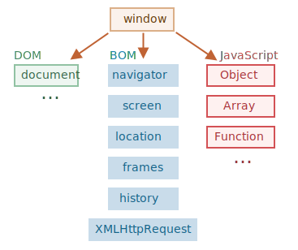
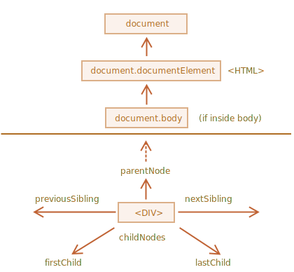

# Lesson 13: Web API Intro

## window

There’s a “root” object called `window`. It has two roles:

- First, it is a global object for JavaScript code. But currently better to use
  with [Global Object](https://developer.mozilla.org/en-US/docs/Glossary/Global_object).
- Second, it represents the “browser window” and provides methods to control it.

```ts
function sayHi() {
  alert("Hello");
}

// global functions are methods of the global object:
window.sayHi();

alert("Hola!"); // actually window.alert
```



## BOM

The Browser Object Model (BOM) represents additional objects provided by the browser (host environment) for working with
everything except the document.

For instance:

- The [navigator](https://developer.mozilla.org/en-US/docs/Web/API/Window/navigator) object provides background
  information about the browser and the operating system.
- The [location](https://developer.mozilla.org/en-US/docs/Web/API/Window/location) object allows us to read the current
  URL and can redirect the browser to a new one.

```ts
alert(location.href); // shows current URL
if (confirm("Go to Wikipedia?")) {
  location.href = "https://wikipedia.org"; // redirect the browser to another URL
}
```

## DOM

The Document Object Model (DOM) connects web pages to scripts or programming languages by representing the structure of
a document—such as the HTML representing a web page—in memory. Usually it refers to JavaScript, even though modeling
HTML, SVG, or XML documents as objects are not part of the core JavaScript language. **The DOM represents a document
with a logical tree.** Nodes can also have event handlers attached to them. Once an event is triggered, the event
handlers get executed.

This is a "tree structure" representation created by the browser that enables the HTML structure to be easily accessed
by programming languages — for example the browser itself uses it to apply styling and other information to the correct
elements as it renders a page, and developers like you can manipulate the DOM with JavaScript after the page has been
rendered.

```html
<!DOCTYPE html>
<html lang="en-US">
  <head>
    <meta charset="utf-8" />
    <title>Simple DOM example</title>
  </head>
  <body>
    <section>
      
      <p>
        Here we will add a link to the
        <a href="https://www.mozilla.org/">Mozilla homepage</a>
      </p>
    </section>
  </body>
</html>
```

[live website](https://mdn.github.io/learning-area/javascript/apis/document-manipulation/dom-example.html)


> CSSOM for styling There’s also a separate specification, [CSS Object Model (CSSOM)](https://www.w3.org/TR/cssom-1/)
> for CSS rules and stylesheets, that explains how they are represented as objects, and how to read and write them. The
> CSSOM is used together with the DOM when we modify style rules for the document. In practice though, the CSSOM is
> rarely required, because we rarely need to modify CSS rules from JavaScript (usually we just add/remove CSS classes,
> not modify their CSS rules), but that’s also possible.

| Data type<br/>(Interface)                                                     | Description                                                                                                                                                                                                                                                                                                                                                                                                                                                                                                                                                                                                                                                                                                                                                                                                                                                                            |
| ----------------------------------------------------------------------------- | -------------------------------------------------------------------------------------------------------------------------------------------------------------------------------------------------------------------------------------------------------------------------------------------------------------------------------------------------------------------------------------------------------------------------------------------------------------------------------------------------------------------------------------------------------------------------------------------------------------------------------------------------------------------------------------------------------------------------------------------------------------------------------------------------------------------------------------------------------------------------------------- |
| [Document](https://developer.mozilla.org/en-US/docs/Web/API/Document)         | When a member returns an object of type `document` (e.g., the `ownerDocument` property of an element returns the `document` to which it belongs), this object is the root `document` object itself.                                                                                                                                                                                                                                                                                                                                                                                                                                                                                                                                                                                                                                                                                    |
| [Node](https://developer.mozilla.org/en-US/docs/Web/API/Node)                 | Every object located within a document is a node of some kind. In an HTML document, an object can be an element node but also a text node or attribute node.                                                                                                                                                                                                                                                                                                                                                                                                                                                                                                                                                                                                                                                                                                                           |
| [Element](https://developer.mozilla.org/en-US/docs/Web/API/Element)           | The `element` type is based on `node`. It refers to an element or a node of type `element` returned by a member of the DOM API. Rather than saying, for example, that the `document.createElement()` method returns an object reference to a `node`, we just say that this method returns the `element` that has just been created in the DOM. `element` objects implement the DOM `Element` interface and also the more basic `Node` interface, both of which are included together in this reference. In an HTML document, elements are further enhanced by the HTML DOM API's [HTMLElement](https://developer.mozilla.org/en-US/docs/Web/API/HTMLElement) interface as well as other interfaces describing capabilities of specific kinds of elements (for instance, [HTMLTableElement](https://developer.mozilla.org/en-US/docs/Web/API/HTMLTableElement) for `<table>` elements). |
| [NodeList](https://developer.mozilla.org/en-US/docs/Web/API/NodeList)         | A `nodeList` is an array of elements, like the kind that is returned by the method `document.querySelectorAll()`. Items in a nodeList are accessed by index in either of two ways: <ul><li>`list.item(1)`</li><li>`list[1]`</li></ul> These two are equivalent. In the first, `item()` is the single method on the `nodeList` object. The latter uses the typical array syntax to fetch the second item in the list.                                                                                                                                                                                                                                                                                                                                                                                                                                                                   |
| [Attr](https://developer.mozilla.org/en-US/docs/Web/API/Attr)                 | When an `attribute` is returned by a member (e.g., by the `createAttribute()` method), it is an object reference that exposes a special (albeit small) interface for attributes. Attributes are nodes in the DOM just like elements are, though you may rarely use them as such.                                                                                                                                                                                                                                                                                                                                                                                                                                                                                                                                                                                                       |
| [NamedNodeMap](https://developer.mozilla.org/en-US/docs/Web/API/NamedNodeMap) | A `namedNodeMap` is like an array, but the items are accessed by name or index, though this latter case is merely a convenience for enumeration, as they are in no particular order in the list. A `namedNodeMap` has an `item()` method for this purpose, and you can also add and remove items from a `namedNodeMap`.                                                                                                                                                                                                                                                                                                                                                                                                                                                                                                                                                                |

_Reference_: [Node vs Element](https://dmitripavlutin.com/dom-node-element/)

### Manipulation

When you create a script, whether inline in a `<script>` element or included in the web page, you can immediately begin
using the API for the `document` or `window` objects to manipulate the `DOM` itself, or any of the various elements in
the web page (the descendant elements of the document). Your DOM programming may be something as simple as the following
example, which displays a message on the console by using the `console.log(`) function:

```html
<html lang="en">
  <head>
    <script>
      // run this function when the document is loaded
      window.addEventListener("load", () => {
        // create a couple of elements in an otherwise empty HTML page
        const heading = document.createElement("h1");
        const headingText = document.createTextNode("Big Head!");
        heading.appendChild(headingText);
        document.body.appendChild(heading);
      });
    </script>
  </head>
  <body></body>
</html>
```

#### Search



If an element has the `id` attribute, we can get the element using the method `document.getElementById(id)`, no matter
where it is.

```html
<div id="elem">
  <div id="elem-content">Element</div>
</div>

<script>
  // get the element
  let elem = document.getElementById("elem");

  // make its background red
  elem.style.background = "red";
</script>
```

> The `id` must be unique. There can be only one element in the document with the given `id`. If there are multiple
> elements with the same `id`, then the behavior of methods that use it is unpredictable, e.g. `document.getElementById`
> may return any of such elements at random. So please stick to the rule and keep `id` unique.

There are a lot of other methods: `querySelectorAll`, `querySelector`, `closest` etc

#### Modify

There are several methods to create, update and remove `element`, `node`, `attributes` etc. Here are some:

- `document.createElement(tag)` - creates a new element node with the given tag
- `document.createTextNode(text)` - creates a new text node with the given text:
- `node.append(...nodes or strings)` – append nodes or strings at the end of node,
- `node.prepend(...nodes or strings)` – insert nodes or strings at the beginning of node,
- `node.before(...nodes or strings)` – insert nodes or strings before node,
- `node.after(...nodes or strings)` – insert nodes or strings after node,
- `node.replaceWith(...nodes or strings)` – replaces node with the given nodes or strings.
- `node.remove()` - remove node

And many others.
