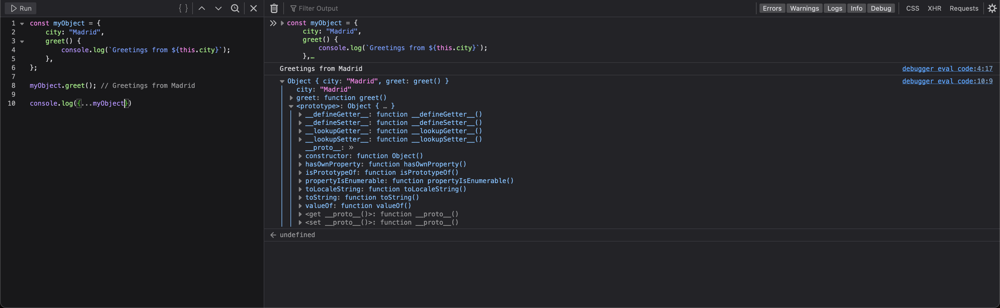

# Lesson 7: OOP, FP and PP

## Object-oriented programming

Object-oriented programming (OOP) is a programming paradigm fundamental to many programming languages, including Java
and C++.

Object-oriented programming is about modeling a system as a collection of objects, where each object represents some
particular aspect of the system. Objects contain both functions (or methods) and data. An object provides a public
interface to other code that wants to use it but maintains its own private, internal state; other parts of the system
don't have to care about what is going on inside the object.

### Classes and instances

When we model a problem in terms of objects in OOP, we create abstract definitions representing the types of objects we
want to have in our system. For example, if we were modeling a school, we might want to have objects representing
professors. Every professor has some properties in common: they all have a name and a subject that they teach.
Additionally, every professor can do certain things: they can all grade a paper and they can introduce themselves to
their students at the start of the year, for example.When we model a problem in terms of objects in OOP, we create
abstract definitions representing the types of objects we want to have in our system. For example, if we were modeling a
school, we might want to have objects representing professors. Every professor has some properties in common: they all
have a name and a subject that they teach. Additionally, every professor can do certain things: they can all grade a
paper and they can introduce themselves to their students at the start of the year, for example.

```
class Professor
    properties
        name
        teaches
    methods
        grade(paper)
        introduceSelf()
```

This defines a `Professor` class with:

* two data properties: `name` and `teaches`
* two methods: `grade()` to grade a paper and `introduceSelf()` to introduce themselves.

On its own, a class doesn't do anything: it's a kind of template for creating concrete objects of that type. Each
concrete professor we create is called an instance of the `Professor` class. The process of creating an instance is
performed by a special function called a **constructor**. We pass values to the constructor for any internal state that
we want to initialize in the new instance.

```
class Professor
    properties
        name
        teaches
    constructor
        Professor(name, teaches)
    methods
        grade(paper)
        introduceSelf()
```

In typescript it would look like.

```ts
class Professor {
    name: string;
    teaches: string;

    constructor(name: string, teaches: string) {
        this.name = name;
        this.teaches = teaches;
    }

    grade(paper: string) {
        console.log(paper);
    }

    introduceSelf() {
        return `My name is Professor ${this.name} and I will be your ${this.teaches} professor.`;
    }
}
```

```ts
const walsh = new Professor("Walsh", "Psychology");
const lillian = new Professor("Lillian", "Poetry");

walsh.teaches; // 'Psychology'
walsh.introduceSelf(); // 'My name is Professor Walsh and I will be your Psychology professor.'

lillian.teaches; // 'Poetry'
lillian.introduceSelf(); // 'My name is Professor Lillian and I will be your Poetry professor.'
```

### Inheritance

Suppose in our school we also want to represent students. Unlike professors, students can't grade papers, don't teach a
particular subject, and belong to a particular year.

However, students do have a name and may also want to introduce themselves, so we might write out the definition of a
student class like this:

```
class Student
    properties
        name
        year
    constructor
        Student(name, year)
    methods
        introduceSelf()
```

We start by observing that students and professors are both people, and people have names and want to introduce
themselves. We can model this by defining a new class `Person`, where we define all the common properties of people.
Then, `Professor` and `Student` can both **derive** from `Person`, adding their extra properties:

```
class Person
    properties
        name
    constructor
        Person(name)
    methods
        introduceSelf()

class Professor : extends Person
    properties
        teaches
    constructor
        Professor(name, teaches)
    methods
        grade(paper)
        introduceSelf()

class Student : extends Person
    properties
        year
    constructor
        Student(name, year)
    methods
        introduceSelf()
```

In typescript it would look like.

```ts
class Person {
    name: string;

    constructor(name: string) {
        this.name = name;
    }

    introduceSelf() {
        return `My name is ${this.name}.`;
    }
}

class Professor extends Person {
    teaches: string;

    constructor(name: string, teaches: string) {
        super(name);
        this.teaches = teaches;
    }

    grade(paper: string) {
        console.log(paper);
    }

    introduceSelf() {
        return `My name is Professor ${this.name} and I will be your ${this.teaches} professor.`;
    }
}

class Student extends Person {
    year: number;

    constructor(name: string, year: number) {
        super(name);
        this.year = year;
    }

    introduceSelf() {
        return `My name is ${this.name} and I'm in the ${this.year} year.`;
    }
}
```

```ts
walsh = new Professor("Walsh", "Psychology");
walsh.introduceSelf(); // 'My name is Professor Walsh and I will be your Psychology professor.'

summers = new Student("Summers", 1);
summers.introduceSelf(); // 'My name is Summers and I'm in the 1 year.'

// We might have a default implementation of introduceSelf() for people who aren't students or professors:

pratt = new Person("Pratt");
pratt.introduceSelf(); // 'My name is Pratt.'
```

When a method has the same name but a different implementation in different classes - is called **polymorphism**. When a
method in a subclass replaces the superclass's implementation, we say that the subclass **overrides** the version in the
superclass.

### Encapsulation

Objects provide an interface to other code that wants to use them but maintain their own internal state. The object's
internal state is kept **private**, meaning that it can only be accessed by the object's own methods, not from other
objects. Keeping an object's internal state private, and generally making a clear division between its public interface
and its private internal state, is called **encapsulation**.

This is a useful feature because it enables the programmer to change the internal implementation of an object without
having to find and update all the code that uses it: it creates a kind of firewall between this object and the rest of
the system.

For example, suppose students are allowed to study archery if they are in the second year or above. We could implement
this just by exposing the student's year property, and other code could examine that to decide whether the student can
take the course:

```ts
if (student.year > 1) {
    // allow the student into the class
}
```

The problem is, if we decide to change the criteria for allowing students to study archery - for example by also
requiring the parent or guardian to give their permission - we'd need to update every place in our system that performs
this test. It would be better to have a `canStudyArchery()` method on `Student` objects, that implements the logic in
one place:

```ts
class Student extends Person {
    year: number;

    constructor(name: string, year: number) {
        super(name);
        this.year = year;
    }

    introduceSelf() {
        return `My name is ${this.name} and I'm in the ${this.year} year.`;
    }

    canStudyArchery() {
        return this.year > 1
    }
}
```

That way, if we want to change the rules about studying archery, we only have to update the `Student` class, and all the
code using it will still work.

In many OOP languages, we can prevent other code from accessing an object's internal state by marking some properties as
`private`. This will generate an error if code outside the object tries to access them:

```ts
class Student extends Person {
    #year: number;

    constructor(name: string, year: number) {
        super(name);
        this.#year = year;
    }

    introduceSelf() {
        return `My name is ${this.name} and I'm in the ${this.#year} year.`;
    }

    canStudyArchery() {
        return this.#year > 1;
    }
}

const student = new Student("Weber", 1);
student.#year; // Property '#year' is not accessible outside class 'Student' because it has a private identifier
```

## Functional programming

Functional programming is a programming paradigm designed to handle pure mathematical functions. This paradigm is
totally focused on writing more compounded and pure functions.

Functional programming has a few important concepts that we need to know and understand. By implementing these concepts
in your applications, you will end up with more functional code. This will make a huge difference in your application,
making it more readable, usable, manageable, easy to test and bug-free.

### What functional programming isn't

Before we talk about what functional programming is, let's talk about what it is not. In fact, let's talk about all the
language constructs you should throw out

* Loops
    * `while`
    * `do...while`
    * `for`
    * `for...of`
    * `for...in`
* Variable declarations with `var` or `let`
* Void functions
* Object mutation (for example: `o.x = 5`;)
* Array mutator methods
    * `copyWithin`
    * `fill`
    * `pop`
    * `push`
    * `reverse`
    * `shift`
    * `sort`
    * `splice`
    * `unshift`
* Map mutator methods
    * `clear`
    * `delete`
    * `set`
* Set mutator methods
    * `add`
    * `clear`
    * `delete`

How can you possibly program without those features? That's exactly what we are going to explore in the next few
sections.

### Pure functions

Just because your program contains functions does not necessarily mean that you are doing functional programming.
Functional programming distinguishes between pure and impure functions. It encourages you to write pure functions. A
pure function must satisfy both of the following properties:

* Referential transparency: The function always gives the same return value for the same arguments. This means that the
  function cannot depend on any mutable state.
* Side-effect free: The function cannot cause any side effects. Side effects may include I/O (e.g., writing to the
  console or a log file), modifying a mutable object, reassigning a variable, etc.

```ts
function multiply(a: number, b: number) {
    return a * b;
}
```

Not _pure functions_:

```ts
let heightRequirement = 46;

// Impure because it relies on a mutable (reassignable) variable.
function canRide(height: number) {
    return height >= heightRequirement;
}

// Impure because it causes a side-effect by logging to the console.
function multiply(a: number, b: number) {
    console.log('Arguments: ', a, b);
    return a * b;
}
```

There are several benefits to pure functions:

* They're easier to reason about and debug because they don't depend on mutable state.
* The return value can be cached or "memoized" to avoid recomputing it in the future.
* They're easier to test because there are no dependencies (such as logging, Ajax, database, etc.) that need to be
  mocked.

If a function you're writing or using is `void` (i.e., it has no return value), that's a clue that it's impure. If the
function has no return value, then either it's a no-op or it's causing some side effect. Along the same lines, if you
call a function but do not use its return value, again, you're probably relying on it to do some side effect, and it is
an impure function.

### Composition

Composition can be expressed as combination—it’s a process of combining multiple functions in a hierarchy to
produce a new function or perform a computation. From school you should remember topics of functions in
math: `(f∘g)(x)=f(g(x))`.

A couple of important points about function composition:

* We can compose any number of functions (we're not limited to two).
* One way to compose functions is simply to take the output from one function and pass it to the next (i.e., `f(g(x))`).

```ts
const splitName = (name: string) => name.split("_").join(" ");

const capitalize = (name: string) => name.toUpperCase();

console.log(capitalize(splitName("leonardo_maldonado"))); // LEONARDO MALDONADO
```

```ts
// h(x) = x + 1
// number -> number
function h(x: number) {
    return x + 1;
}

// g(x) = x^2
// number -> number
function g(x: number) {
    return x * x;
}

// f(x) = convert x to string
// number -> string
function f(x: number) {
    return x.toString();
}

// y = (f ∘ g ∘ h)(1)
const y = f(g(h(1)));
console.log(y); // '4'
```

### Recursion

Recursion is a process of calling itself. A function that calls itself is called a recursive function.

```ts
function recurse() {
    // function code
    recurse();
    // function code
}

recurse();
```

A recursive function must have a condition to stop calling itself. Otherwise, the function is called indefinitely.

Recursion is a way to handle `loop` in non functional programming languages.

```ts
function pow(x: number, n: number) {
    let result = 1;

    // multiply result by x n times in the loop
    for (let i = 0; i < n; i++) {
        result *= x;
    }

    return result;
}

console.log(pow(2, 3)); // 8
```

Recursion in functional programming languages.

```ts
function pow(x: number, n: number): number {
    if (n <= 1) {
        return x;
    }

    return x * pow(x, n - 1);
}

console.log(pow(2, 3)); // 8
```

### Higher-order functions

JavaScript has first-class functions that can be passed around just like any other value. So, it should come as no
surprise that we can pass a function to another function. We can also return a function from a function. One way to
think of a **higher-order function** is: It's a function that accepts (what's typically called) a callback function.

```ts
const vehicles = [
    {make: "Honda", model: "CR-V", type: "suv", price: 24045},
    {make: "Honda", model: "Accord", type: "sedan", price: 22455},
    {make: "Mazda", model: "Mazda 6", type: "sedan", price: 24195},
    {make: "Mazda", model: "CX-9", type: "suv", price: 31520},
    {make: "Toyota", model: "4Runner", type: "suv", price: 34210},
    {make: "Toyota", model: "Sequoia", type: "suv", price: 45560},
    {make: "Toyota", model: "Tacoma", type: "truck", price: 24320},
    {make: "Ford", model: "F-150", type: "truck", price: 27110},
    {make: "Ford", model: "Fusion", type: "sedan", price: 22120},
    {make: "Ford", model: "Explorer", type: "suv", price: 31660},
];

const averageSUVPrice = vehicles
    .filter((v) => v.type === "suv")
    .map((v) => v.price)
    .reduce((sum, price, _, array) => sum + price / array.length, 0);

console.log(averageSUVPrice); // 33399
```

### Immutability

All variables in FP should be _immutable_. An immutable object is an object that can’t be modified after its creation.
But what if want to modify an object by adding a new element. We should create a new object, a copy of the actual
object, and not mutate it.

**Immutability** is a powerful concept that helps you to prevent the creation of unexpected side effects in your
codebase.
It makes it easier for you to read and compose your code.

```ts
// using const not enough
const car = {
    model: 'Tesla',
    year: 2020
};

const newCar = car;
newCar.model = 'Honda'; // WARNING: original object was updated too. 
```

```ts
// using const not enough
const car = {
    model: 'Tesla',
    year: 2020
};

const newCar = {...car};
newCar.model = 'Honda';
```

How we can protect from updating variable. We can do that both in JS and TS.

If JS use `const` for primitives is enough, for objects we can use `Object.freeze`;

In TS using `readonly` would suffice.

```js
"use strict";

// using const not enough
const car = Object.freeze({
	model: "Tesla",
	year: 2020,
});

const newCar = car;
newCar.model = "Honda"; // Uncaught TypeError: "model" is read-only
```

```ts
// using const not enough
const car = {
    model: "Tesla",
    year: 2020,
} as const;

const newCar = car;
newCar.model = "Honda"; // Cannot assign to 'model' because it is a read-only property.
```

### Declarative vs. Imperative

Functional programming is a sub-paradigm of the **Declarative programming paradigm**, with its own rules to follow when
writing code.

_Declarative programming_ is a programming paradigm where we specify the program logic without describing the flow
control. _Declarative programming_ is all about **what** to do to achieve a certain result.

```ts
const numbers = [1, 2, 3, 4, 5];

const sumNumbers = (n: number[]) => n.reduce((acc, current) => acc + current);

console.log(sumNumbers(numbers)); // 15
```

_Imperative programming_ is a programming paradigm where we specify the program logic describing the flow control.
_Imperative programming_ is all about **how** to achieve a certain result.

```ts
const numbers = [1, 2, 3, 4, 5];

const sumNumbers = (n: number[]) => {
    let finalResult = 0;

    for (let i = 0; i < n.length; i++) {
        finalResult += n[i];
    }

    return finalResult;
};

console.log(sumNumbers(numbers)); // 15
```

## Prototypal programming

Prototypes are the mechanism by which JavaScript objects inherit features from one another.

```ts
const myObject = {
    city: "Madrid",
    greet() {
        console.log(`Greetings from ${this.city}`);
    },
};

myObject.greet(); // Greetings from Madrid
```



You can access methods from `prototype`:

```ts
myObject.toString(); // "[object Object]"
```

Every object in JavaScript has a built-in property, which is called its **prototype**. The prototype is itself an
object, so the prototype will have its own prototype, making what's called a **prototype chain**. The chain ends when we
reach a prototype that has `null` for its own prototype.

**Note**: The property of an object that points to its prototype is not called `prototype`. Its name is not standard,
but in practice all browsers use `__proto__`. The standard way to access an object's prototype is
the `Object.getPrototypeOf()` method.

When you try to access a property of an object: if the property can't be found in the object itself, the prototype is
searched for the property. If the property still can't be found, then the prototype's prototype is searched, and so on
until either the property is found, or the end of the chain is reached, in which case undefined is returned.

So when we call myObject.toString(), the browser:

* looks for `toString` in `myObject`
* can't find it there, so looks in the prototype object of `myObject` for `toString`
* finds it there, and calls it.

What is the prototype for `myObject`? To find out, we can use the function `Object.getPrototypeOf()`:

```ts
Object.getPrototypeOf(myObject); // Object { }
```

The prototype of an object is not always `Object.prototype`. But it is _last_ because _everything is object in JS_. Try
this:

```ts
const myDate = new Date();
let object = myDate;

do {
    object = Object.getPrototypeOf(object);
    console.log(object);
} while (object);

// Date.prototype
// Object { }
// null
```

This code creates a Date object, then walks up the prototype chain, logging the prototypes. It shows us that the
prototype of `myDate` is a `Date.prototype` object, and the prototype of that is `Object.prototype`.

### Shadowing properties

```ts
const myDate = new Date(1995, 11, 17);

console.log(myDate.getDate()); // 17

myDate.getDate = function () {
    return 42;
};

myDate.getDate(); // 42
```

This should be predictable, given the description of the prototype chain. When we call getYear() the browser first looks
in myDate for a property with that name, and only checks the prototype if myDate does not define it. So when we add
getYear() to myDate, then the version in myDate is called.

This is called **shadowing** the property.

### Setting a prototype

There are various ways of setting an object's prototype in JavaScript, and here we'll describe only **constructors**.

In JavaScript, all functions have a property named `prototype`. When you call a function as a constructor, this property
is set as the `prototype` of the newly constructed object (by convention, in the property named `__proto__`).

So if we set the `prototype` of a constructor, we can ensure that all objects created with that constructor are given
that prototype:

```ts
const personPrototype = {
    greet() {
        console.log(`hello, my name is ${this.name}!`);
    },
};

function Person(name) {
    this.name = name;
}

Object.assign(Person.prototype, personPrototype);
// or
// Person.prototype.greet = personPrototype.greet;
```

Here we create:

* an object personPrototype, which has a greet() method
* a Person() constructor function which initializes the name of the person to create.

We then put the methods defined in `personPrototype` onto the `Person` function's prototype property
using `Object.assign`.

After this code, objects created using `Person()` will get `Person.prototype` as their prototype, which automatically
contains the `greet` method.

```ts
const reuben = new Person("Reuben");
reuben.greet(); // hello, my name is Reuben!
```

This also explains why we said earlier that the prototype of `myDate` is called `Date.prototype`: it's the prototype
`property` of the `Date` constructor.

#### Own properties

The objects we create using the Person constructor above have two properties:

* a `name` property, which is set in the constructor, so it appears directly on `Person` objects
* a `greet()` method, which is set in the prototype.

It's common to see this pattern, in which methods are defined on the prototype, but data properties are defined in the
constructor. That's because methods are usually the same for every object we create, while we often want each object to
have its own value for its data properties (just as here where every person has a different name).

Properties that are defined directly in the object, like `name` here, are called own properties, and you can check
whether a property is an own property using the static `Object.hasOwn()` method:

```ts
const irma = new Person("Irma");

console.log(Object.hasOwn(irma, "name")); // true
console.log(Object.hasOwn(irma, "greet")); // false
```

## OOP vs PP

The OOP and PP looks very similar, in ES2016 JS even mimics OOP's main principle. But it's worth understanding the
differences between these features and the "classical" OOP concepts described above.

First, in class-based OOP, classes and objects are two separate constructs, and objects are always created as instances
of classes. Also, there is a distinction between the feature used to define a class (the class syntax itself) and the
feature used to instantiate an object (a constructor). In JavaScript, we can and often do create objects without any
separate class definition, either using a function or an object literal. This can make working with objects much more
lightweight than it is in classical OOP.

Second, although a prototype chain looks like an inheritance hierarchy and behaves like it in some ways, it's different
in others. When a subclass is instantiated, a single object is created which combines properties defined in the subclass
with properties defined further up the hierarchy. With prototyping, each level of the hierarchy is represented by a
separate object, and they are linked together via the `__proto__` property. The prototype chain's behavior is less like
inheritance and more like `delegation`. Delegation is a programming pattern where an object, when asked to perform a
task,
can perform the task itself or ask another object (its delegate) to perform the task on its behalf. In many ways,
delegation is a more flexible way of combining objects than inheritance (for one thing, it's possible to change or
completely replace the delegate at run time).

## Example:

### 1

Create methods for the `Calculator` class:

```ts
const calculator = new Calculator()

console.log(calculator.add(10, 5)) // 15

console.log(calculator.subtract(10, 5)) // 5

console.log(calculator.multiply(10, 5)) // 50

console.log(calculator.divide(10, 5)) // 2
```

### 2

Create the _instance properties_ `fullname` and `email` in the `Employee` class. Given a person's `first`
and `last` names:

* Form the `fullname` by simply joining the `first` and `last` name together, separated by a space.
* Form the `email` by joining the `first` and `last` name together with a `.` in between, and follow it
  with `@company.com` at the end. Make sure the entire email is in **lowercase**.

```js
let emp1 = new Employee("John", "Smith")
console.log(emp1.fullname) // "John Smith"

let emp2 = new Employee("Mary", "Sue")
console.log(emp2.email) // "mary.sue@company.com"

let emp3 = new Employee("Antony", "Walker")
console.log(emp3.firstname) // "Antony"
console.log(emp3.lastname) // "Walker"
```

### 3

Your task is to create a class `Circle` with a constructor that creates a circle with a `radius` provided by an
argument. The circles constructed must have two methods `getArea()` and `getPerimeter()` which give both respective
areas and perimeter (circumference).

```js
let circy = new Circle(11)
circy.getArea() // 380.132711084365
circy.getPerimeter() // 69.115038378975451
```

### 4

Create a class named `User` and create a way to check the number of users (number of instances) that were created, so
that the value can be accessed as a _class attribute_.

```js
u1 = new User("johnsmith10")
console.log(User.userCount) // 1
console.log(u1.username) // "johnsmith10"

u2 = new User("marysue1989")
console.log(User.userCount) // 2
console.log(u2.username) // "marysue1989"

u3 = new User("milan_rodrick")
console.log(User.userCount) // 3
console.log(u3.username) // "milan_rodrick"
```
