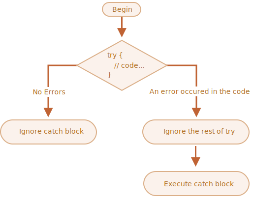

# Lesson 8: Error handling and Modules

## Error handling

No matter how great we are at programming, sometimes our scripts have errors. They may occur because of our mistakes, an
unexpected user input, an erroneous server response, and for a thousand other reasons.

Usually, a script “dies” (immediately stops) in case of an error, printing it to console.

But there’s a syntax construct `try...catch` that allows us to “catch” errors so the script can, instead of dying, do
something more reasonable.

### `try…catch` syntax

```ts
try {

// code...

} catch (err) {

// error handling

}
```



So, an error inside the `try {...}` block does not kill the script – we have a chance to handle it in catch.

```ts
try {

    alert('Start of try runs');  // (1) <--

    lalala; // error, variable is not defined!

    alert('End of try (never reached)');  // (2)

} catch (err) {

    alert(`Error has occurred!`); // (3) <--

}
```

`try...catch` works **synchronously**

```ts
try {
    setTimeout(function () {
        noSuchVariable; // script will die here
    }, 1000);
} catch (err) {
    alert("won't work");
}
```

To catch an exception inside a scheduled function, `try...catch` must be inside that function:

```ts
setTimeout(function () {
    try {
        noSuchVariable; // try...catch handles the error!
    } catch {
        alert("error is caught here!");
    }
}, 1000);
```

### Error object

When an error occurs, JavaScript generates an object containing the details about it. The object is then passed as an
argument to catch:

For all built-in errors, the error object has two main properties:

* `name`

  Error name. For instance, for an undefined variable that’s `ReferenceError`.


* `message`

  Textual message about error details.

There are other non-standard properties available in most environments. One of most widely used and supported is:

* `stack`

Current call stack: a string with information about the sequence of nested calls that led to the error. Used for
debugging purposes.

```ts
try {
    lalala; // error, variable is not defined!
} catch (err) {
    console.log(err.name); // ReferenceError
    console.log(err.message); // lalala is not defined
    console.log(err.stack); // ReferenceError: lalala is not defined at (...call stack)

    // Can also show an error as a whole
    // The error is converted to string as "name: message"
    console.log(err); // ReferenceError: lalala is not defined
}
```

### Using `try…catch`

Let’s explore a real-life use case

```ts
let json = "{ bad json }";

try {
    let user = JSON.parse(json); // <-- when an error occurs...
    alert(user.name); // doesn't work
} catch (err) {
    // ...the execution jumps here
    alert("Our apologies, the data has errors, we'll try to request it one more time.");
    alert(err.name);
    alert(err.message);
}
```

What if `json` is syntactically correct, but doesn’t have a required `name` property?

### `Throw` operator

Technically, we can use anything as an error object. That may be even a primitive, like a number or a string, but it’s
better to use objects, preferably with name and message properties (to stay somewhat compatible with built-in errors).

JavaScript has many built-in constructors for standard errors: `Error`, `SyntaxError`, `ReferenceError`, `TypeError` and
others. We can use them to create error objects as well.

```ts
let error = new Error(message);
// or
let error = new SyntaxError(message);
let error = new ReferenceError(message);
```

For built-in errors (not for any objects, just for errors), the `name` property is exactly the name of the constructor.
And `message` is taken from the argument.

```ts
let error = new Error("Things happen o_O");

console.log(error.name); // Error
console.log(error.message); // Things happen o_O
```

So we can throw an error:

```ts
let json = '{ "age": 30 }'; // incomplete data

try {
    let user = JSON.parse(json); // <-- no errors

    if (!user.name) {
        throw new SyntaxError("Incomplete data: no name"); // (*)
    }

    console.log(user.name);
} catch (err) {
    console.log("JSON Error: " + err.message); // JSON Error: Incomplete data: no name
}
```

In the line `(*)`, the `throw` operator generates a `SyntaxError` with the given `message`, the same way as JavaScript
would generate it itself. The execution of `try` immediately stops and the control flow jumps into `catch`.

Now `catch` became a single place for all error handling: both for `JSON.parse` and other cases.

We can rethrow too:

```ts
function readData() {
    let json = '{ "age": 30 }';

    try {
        // ...
        blabla(); // error!
    } catch (err) {
        // ...
        if (!(err instanceof SyntaxError)) {
            throw err; // rethrow (don't know how to deal with it)
        }
    }
}

try {
    readData();
} catch (err) {
    console.log("External catch got: " + err); // caught it!
}
```

### `try…catch…finally`

The `try...catch` construct may have one more code clause: `finally`.

If it exists, it runs in all cases:

* after `try`, if there were no errors,
* after `catch`, if there were errors.

```ts
try {
    // ... try to execute the code ...
} catch (err) {
    // ... handle errors ...
} finally {
    // ... execute always ...
}
```

## Modules

Application can be splited into multiple files or _modules_.

Modules can load each other and use special directives `export` and `import` to interchange functionality, call
functions of one module from another one:

* `export` keyword labels variables and functions that should be accessible from outside the current module.
* `import` allows the import of functionality from other modules.

For instance, if we have a file `sayHi.ts` exporting a function:

```ts
// 📁 sayHi.ts
export function sayHi(user: string) {
    console.log(`Hello, ${user}!`);
}
```

…Then another file may import and use it:

```ts
// 📁 main.ts
import {sayHi} from "./sayHi.ts";

console.log(sayHi); // function...
sayHi("John"); // Hello, John!
```

Currently, browsers also supports module